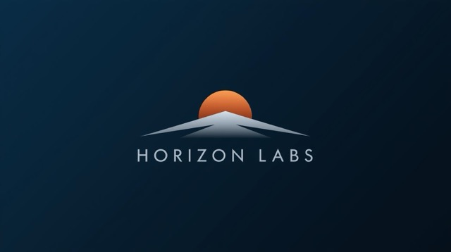

# Horizon Labs

Horizon Labs is a company founded in the Education and Technology industry. Horizon Labs aims to improve the learning experience for both students and educators by leveraging the power of AI and Large Language Models (LLMs). Our mission is to create innovative, accessible, and effective educational tools that enhance critical thinking and personalized learning. By integrating cutting-edge technology with best learning practices, we strive to empower learners of all backgrounds to reach their full potential in an ever-evolving digital world.

Table of Contents
---

- [People](./team/)
- [Diversity](./team/diversity.md)
- [Product & Research](./product_research/)
    - [Market](./product_research/market.md)
    - [Roadmap](./product_research/roadmap.md)
