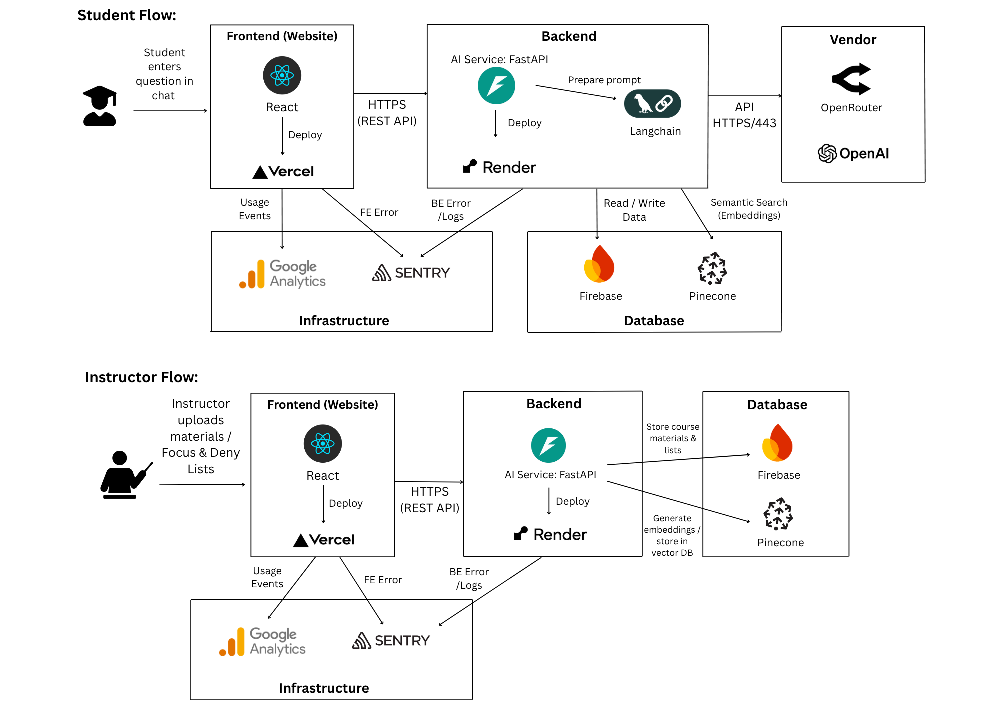

# Architecture Diagram Explanation

## Diagram

## Explanation
Our MVP system is designed as a modular web application that supports both students and teachers with a shared architecture. The platform consists of a Next.js frontend, a FastAPI backend deployed on Railway, Firestore as the main database, Pinecone for semantic search, and LLM integrations via OpenRouter/OpenAI. Hosting and deployment are designed for rapid iteration and scalability with minimal DevOps overhead.

### Frontend: Next.js on Vercel
We use Next.js to build both student- and teacher-facing interfaces. Students interact with learning modules, progress tracking, and AI tutoring, while teachers use dashboards for course management and monitoring. Hosting on Vercel provides instant deployments, preview environments, and global CDN delivery.
Trade-off: Vercel simplifies frontend deployment but advanced backend logic must be hosted separately.

### Backend: FastAPI on Render
FastAPI serves as the backend, exposing APIs for authentication, course management, progress tracking, and AI-powered features. Render was chosen for its developer-friendly deployment, GitHub integration, and auto-scaling.
Trade-off: Offers less control than AWS/GCP, but accelerates MVP development and iteration.

### Database: Firestore
Firestore stores users, courses, assignments, submissions, and progress data. Its real-time sync capabilities enable live dashboards for teachers and responsive feedback loops for students.
Trade-off: Firestore’s NoSQL design makes it less suitable for complex relational analytics, but it’s ideal for MVP needs.

### Vector Store: Pinecone
Pinecone stores embeddings of course content, resources, and student/teacher queries, enabling semantic search and personalized AI recommendations.
Trade-off: Vendor dependency, though alternatives like pgvector remain open for future use.

### AI Integration: OpenRouter / OpenAI APIs
The backend integrates with LLM providers via OpenRouter, powering student tutoring, Q&A, feedback generation, and teacher-side summaries or insights.
Trade-off: Dependence on third-party APIs introduces latency, cost, and vendor risk, but allows rapid delivery of AI features without model hosting.

### Monitoring & Analytics: Sentry & Google Analytics
Sentry: Tracks runtime errors, frontend crashes, and backend issues, ensuring reliability across the system.

Google Analytics: Captures student and teacher engagement data (e.g., active users, retention, feature usage), providing insights to guide improvements.
 Trade-off: Third-party monitoring introduces cost and requires proper data governance for compliance.

## Alignment with Use Cases
1. Students: Access content, track progress in real time (Firestore + Next.js), and receive AI-powered tutoring (FastAPI + LLM + Pinecone).

2. Teachers: Create/manage courses, monitor student progress live (Firestore), and gain AI-driven insights (FastAPI + LLM).

3. Cross-Cutting: Reliable monitoring (Sentry), user engagement tracking (GA), and rapid iteration through Vercel + Railway.
