# **Assignment 3 - CUJ Runthrough + Demo (OpenRouter)**
## CUJ Document

### Group Details:
**Group Name:** Horizon Labs

**Student Names and Numbers:**
- Vivian Song, 1008816943
- Olivia Wong, 1009076526
- Samuel Ruo, 1007676846
- Jiajun Li, 1008866470

**Submission Date:** September 24, 2025

### ⚡ TL;DR 
We experimented with the output of multiple free LLMs using the OpenRouter API. To do so we connected the API to a simple interface using Python and Django. This setup lets us compare multiple LLMs side by side and demonstrates how the OpenRouter API could fit into our tech stack for a future prototype.

### 🎯 Goal
As a **CSC491 student**, I want to **set up and test OpenRouter’s free models** through a simple chat interface so that I can **evaluate their reliability and limitations** and select the right model for our prototype.

### 🧰 Tools Used
- **OpenRouter Console** - to generate API keys and check activity/usage
- **OpenRouter Documentation** - for quickstart guide, model list, and rate limit details
- **Google Search** - to find external references, debugging help, and interface setup guides
- **ChatGPT** - to debug errors and get coding assistance
- **VS Code** - to set up the environment, run Python scripts, and build the chat interface
- **GitHub Repo (“product research” folder)** - to organize experiment code

### 🧑‍💻 Persona Description
- **Role / Background:** CSC491 student exploring LLMs to use for their prototype
- **Experience Level:** Some prior experience with using LLMs, intermediate proficiency with back-end development, particularly APIs, Python and building simple interfaces, but first time using OpenRouter
- **Familiarity with Platform:** No prior experience with OpenRouter; first exposure through documentation and quickstart guide

### 📘 Summary of Findings
The Critical User Journey (CUJ) of setting up and testing OpenRouter had both smooth onboarding experiences and some friction points. Overall, creating an account, locating documentation, and setting up the development environment in VS Code was straightforward and well-documented. However, deeper integration surfaced challenges related to error handling, rate limits, and usage monitoring.

One main positive was the accessibility of the initial setup process. Creating an account and generating an API key required minimal time and effort, and the quickstart guide provided a clear roadmap for first-time users. This made the transition from registration to code implementation efficient and intuitive. Another success was the flexibility for model experimentation. Once the Python script was running, testing different free models was straightforward, which encouraged exploration and rapid iteration. Finally, integration into a simple chat application could be completed within a single session. Using OpenRouter’s API and reference materials, we built a functional interface, tested multiple models, and added features such as model switching.

However, there were also several challenges. The free Gemini 2.0 model produced intermittent errors beyond the user’s control, creating unpredictability during development. Rate limits and unclear monitoring also caused difficulties. While documentation specified request limits, tracking usage in real time required manual checking via the “Activity” console, which wasn’t ideal for ongoing development. Environment setup and debugging introduced additional friction. Small issues with environment variables and coding bugs required switching between tools and online resources, slowing progress. Finally, documentation provided limited guidance on handling errors, leaving users to rely on trial and error for rate limit or model-specific issues, which could be especially challenging for new developers.

#### Highlights & Lowlights Table
| Task                            | Severity | Notes                                                                                   |
|---------------------------------|:--------:|-----------------------------------------------------------------------------------------|
| Account creation & API key setup|  Great   | Fast, intuitive process; console easy to navigate                                       |
| Quickstart documentation        |  Great   | Clear guide, made initial setup smooth                                                  |
| Model experimentation           |  Great   | Easy to test multiple free models and iterate quickly                                   |
| Interface development           |  Great   | Built simple chat app within one session using reference materials                       |
| Model switching feature         | Moderate | Required extra context switching, but achievable with ChatGPT support                   |
| Rate limits and usage monitoring | Severe | Daily and per-minute limits were unclear before checking. No API tracking; manual checking console for limits is inconvenient. |
| API error code debugging      | Moderate - Severe | Errors were easily diagnosable with ChatGPT, however some errors were not within users control |
| Frequent context switching      | Moderate | Needed to move between docs, console, VS Code, ChatGPT, and Google                      |

#### Recommendations
**Product Improvements:**
During the testing and debugging, we noticed that when API calls fail or the rate limits are reached, the current error messages can be unclear in diagnosing where the error stems from. Adding clear and user-friendly error messages or a clear list of common error codes in the documentation would significantly improve this experience. This would help people quickly find common issues, whether it’s because of incorrect API keys, network problems, or model-specific limitations. 

While we created an interface that successfully connects to the OpenRouter API, the setup process may be unclear for first-time users. To improve onboarding, we recommend creating a step-by-step tutorial with screenshots that guide users through the entire process of connecting OpenRouter to a simple project that utilizes more than one model. While the Quickstart guide is a good place to start, it may not be enough for some users to get a full understanding of OpenRouters capability. This could help reduce the onboarding time and lower the learning curve for new users.

Additionally, we think the API should implement a lightweight logging to track response times, model usage, and error rates for having useful feedback and performance bottlenecks. This could help developers build an understanding of their usage patterns, and support optimization of workflows over time. This would be especially helpful for free users who have rate limitations to worry about.

**For Future Users:**
Before starting, it is important to carefully review the setup documentation to fully understand the OpenRouter API authentication steps and interface configuration. Taking the time to go through the documentation beforehand can prevent common issues and bugs such as invalid API keys or connection failures. It is also recommended to read the documentation to understand the limitations being a free user presents as this information is not clearly grouped in the documentation.

The Quickstart guide offers a great way to test if all the parts of your connection and environment are working. It is recommended to ensure this is working thoroughly and stable before moving onto creating any interface. This includes running queries multiple times to see if any errors occur that you may need to make considerations for in any potential prototype.

As you work on an interface, or anything outside the scope of the documentation be prepared for context switching. Keeping key resources such as the console, documentation, and ChatGPT open in separate tabs can help you troubleshoot issues more efficiently. In particular having some sort of AI helper, asking it to provide links to potential fixes and error sources tailored to your specific issue can greatly aid in reducing context switching.

#### CUJ Overview Table
| Task                                                       | Time  | Switches |
|------------------------------------------------------------|:-----:|:--------:|
| Open OpenRouter Console and generate API key               | 2 min |    1     |
| Explore OpenRouter documentation (quickstart, models, rate limits) | 15 min |    3     |
| Set up environment in VS Code and implement quickstart code| 10 min|    1     |
| Debug environment variable error                           | 2 min |    1     |
| Run Python script and test free models                     | 15 min|    1     |
| Diagnose recurring rate-limit errors                       | 10 min|    1     |
| Check usage/activity history in console                    | 5 min |    2     |
| Build simple chat interface (Django)                       | 30 min|    2     |
| Debug minor bugs in chat interface                         | 5 min |    1     |
| Add button to switch between models                        | 20 min|    2     |
| Implement multiple models and compare results              | 10 min|    1     |

**Total Time:** 2.5 - 3 hours
**Total Context Switches:** 16 switches

### Full CUJ Table (Step-by-Step Documentation)
| Step | Notes (What + Why) | Screenshot |
|:---:|:--|:--:|
| 1 | Googled “Openrouter” and created an account.  Our group considered a few different free models, however Openrouter gives us access to a whole catalog of free models through one end point making it ideal for prototyping.  Time: 5 mins  Great | 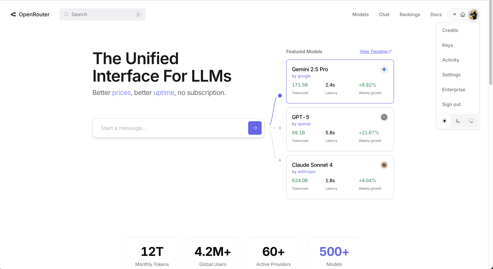 |
| 2 | Googled “Openrouter docs”, opened documentation and read the quickstart guide. Searched for Gemini model code in list of models.  One model we considered is Gemini since we knew it had free credits.  Time: 5 - 10 mins  Great | 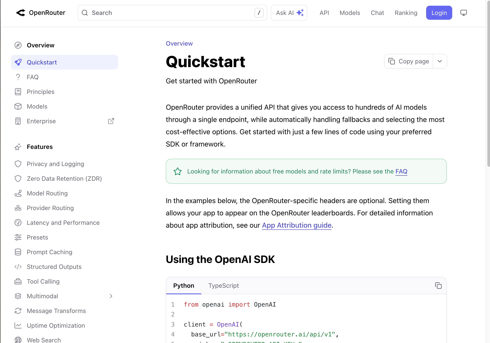 |
| 3 | **Switch:** Switched to Openrouter console/account page and generated API key.  After reading the example, we had to context switch to account settings and set up a new API key for this application. This was an easy process.  Time: 2 mins  Great | 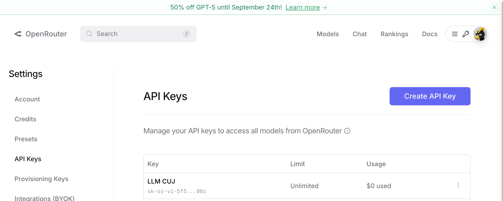 |
| 4 | **Switch:** Opened VS code to set up the environment and implement Quickstart code.  Decided to add this experiment code to our repo under “product research” since we are testing out potential technologies for our product.  Time: 5 - 10 mins  Great | 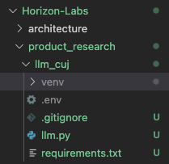 |
| 5 | **Switch:** Had problems with environment variables causing error messages, posted errors in ChatGPT.  We ran into a small error when running the code for the first time. Turns out there was a small error in loading the environment file to the code. This context switch was quick and easy.  Time: 2 mins  Great | 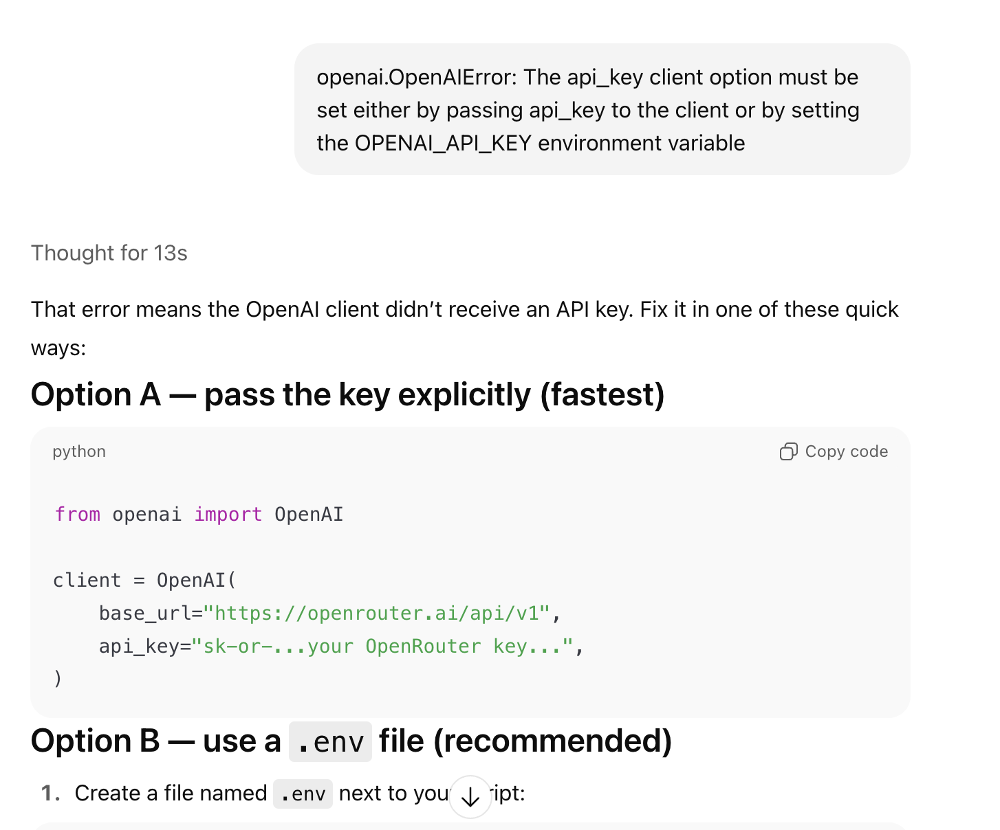 |
| 6 | **Switch:** Error was quickly resolved and was able to access the model through Python script. Experimented a bit with outputs and different free models.  At this point we were able to start testing a few of the different free models in the catalogue by editing the prompt in the code and running the script.   Time: 10 - 20 mins  Great | 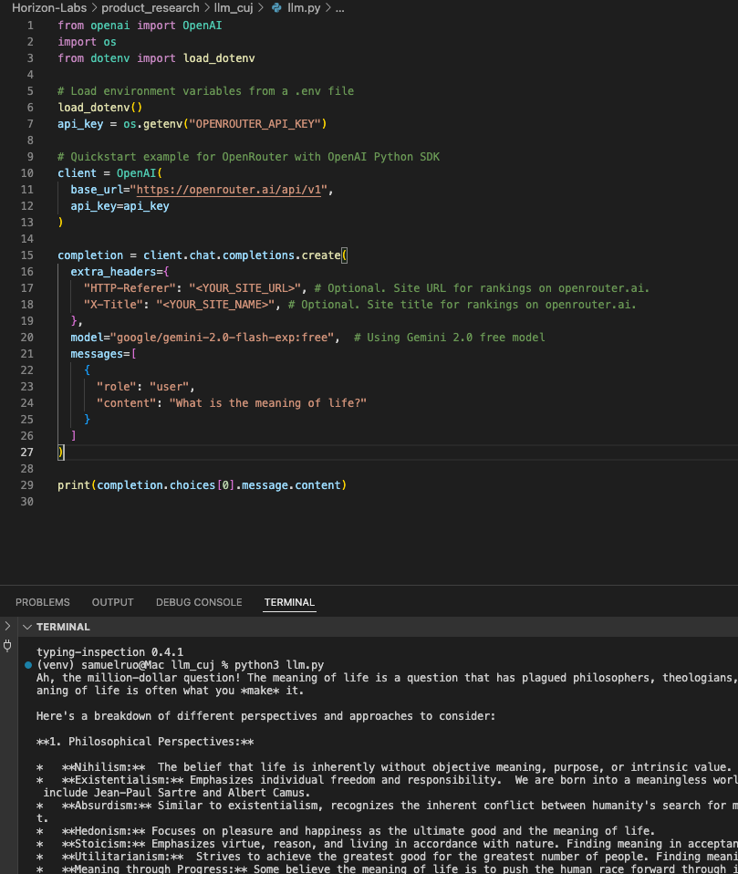 |
| 7 | Ran into error once in a while with Gemini 2.0 free model.  During the previous step we would run into this “rate limit” error code every once in a while. It was not clear it was happening based on the error message.  Time: 5 mins  Moderate |  |
| 8 | **Switch:** Switched to ChatGPT to diagnose error. Could not “fix” the error out right.  Found out reason for the error was out of user control. This could be a serious issue down the line which may require a work around in any potential prototype we create. In other words a severe issue as it is a consistent error with no simple work around.  Time: 5 mins  Severe | 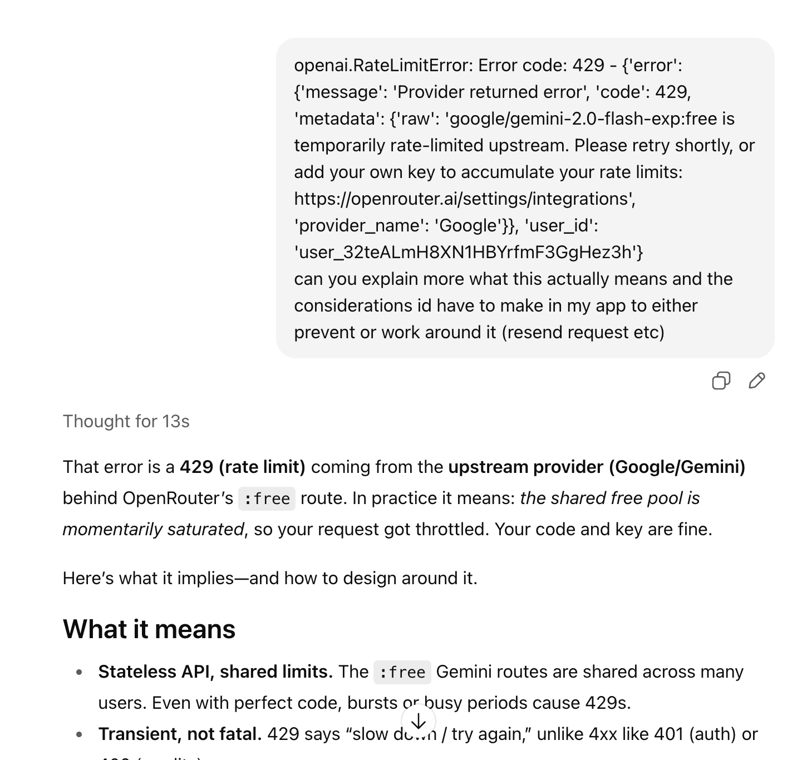 |
| 9 | **Switch:** Continued reading Openrouter documentation. Found information on free request limits (20 requests per minute, 50 per day or 1000 per day if bought $10 of credits).   We chose to work with Openrouter since it has free requests, but we realized it does have some rate limitations which may affect us later on.  Time: 10 mins  Moderate | 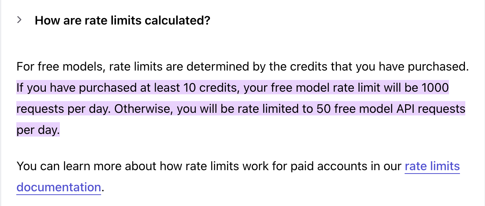 |
| 10 | **Switch:** Continued reading documentation to see if there was a way to keep track of requests. Could not find a way so Googled it.  We were curious if there was a way to track requests within the API, but there was no information in the documentation about this so we googled it.  Time: 5 mins  Moderate | 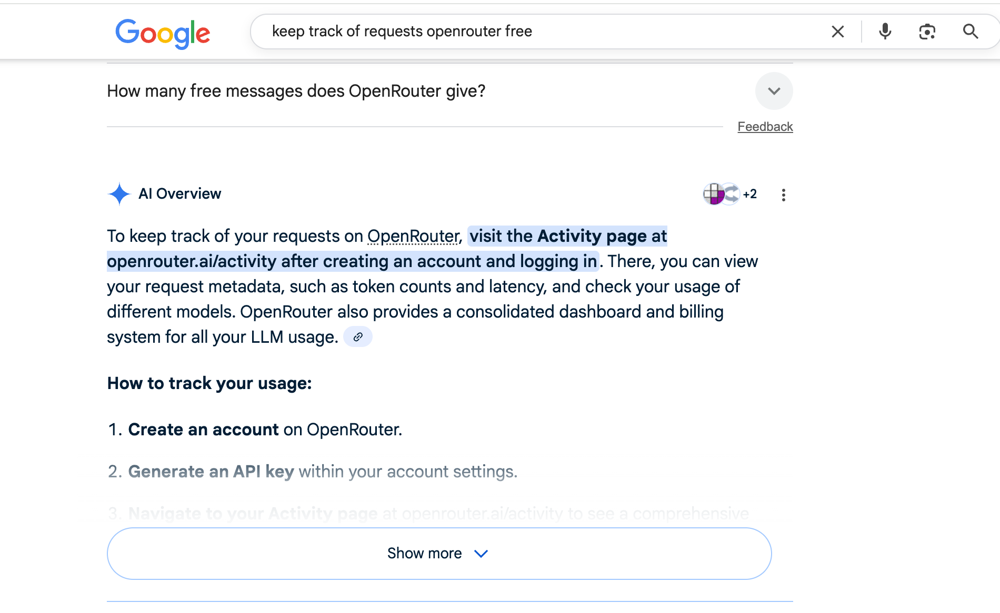 |
| 11 | **Switch:** Switched to Openrouter console and navigated to Activity to see usage history. Activity monitor provided a way to see requests per day.   Since it seemed like there was no way to check this in the code, we had to switch to the Activity dashboard to find usage statistics. This was a bit of an annoying process as it took a bit to learn how the activity console worked, while switching between the docs. This is also a potential severe issue that may need to be addressed with additional code or checked manually.  Time: 5 mins  Severe | 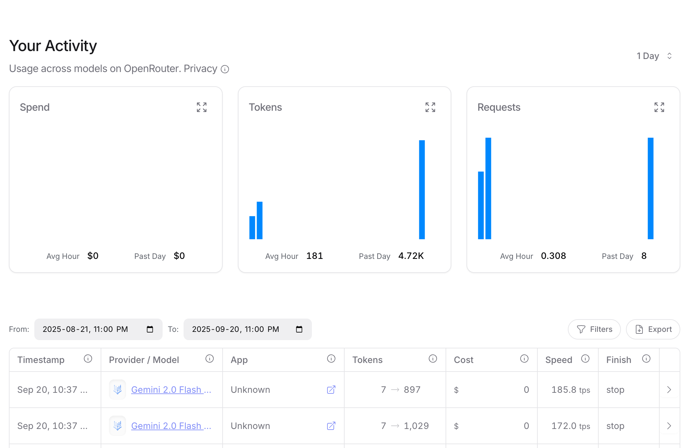 |
| 12 | **Switch:** Used google to find a way to incorporate this into an interface to easily interact with the LLM. Found a guide to use as reference.  It was becoming a bit annoying running the Python script over and over again, so we decided to try and wrap it in a simple interface.   Time: 5 mins  Great | 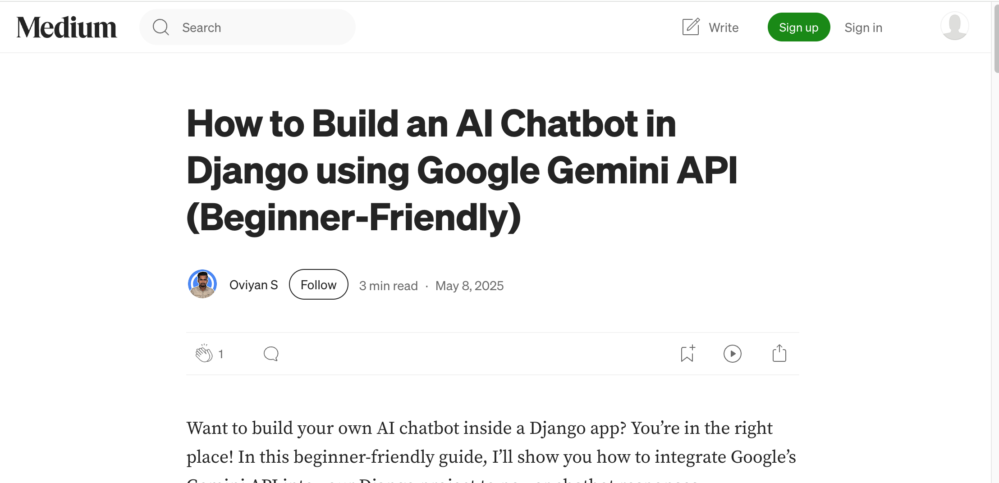 |
| 13 | **Switch:** Used the article as a reference and began coding an LLM chat application with Openrouter access.  Some of us had previous experience using Django so utilizing the guide (subbing in Openrouter connection instead of Gemini) and setting up the interface was a pretty painless process.  Time: 30 mins  Great | 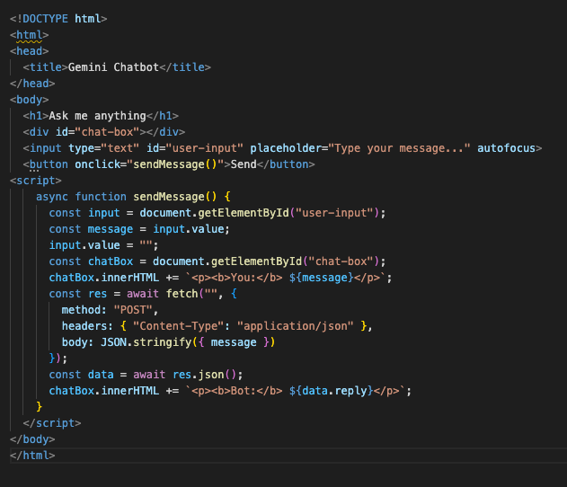 |
| 14 | **Switch:** Ran into some small problems/bugs requiring a bit of googling to fix.  There were a few bugs or things that we needed to relearn, however they were pretty minor and usually required only a quick google search to fix.  Time: 5 mins  Great | 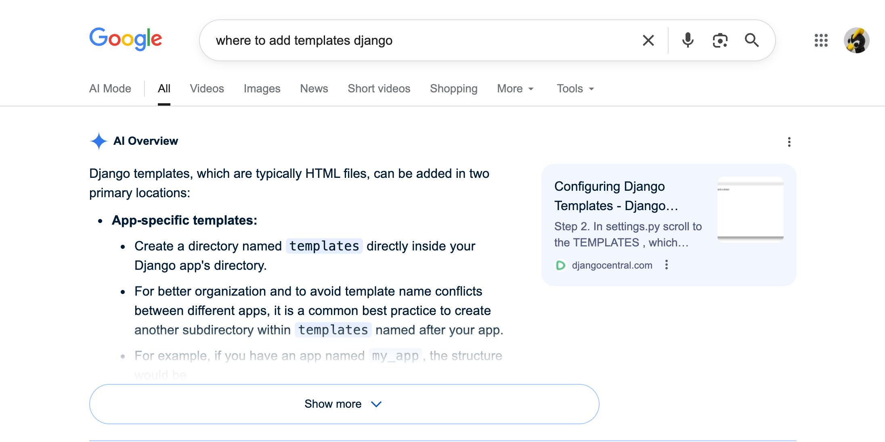 |
| 15 | Finished simple chat interface, test it out (ran into issue outlined above with rate limit error -> 7).  Once we set up the interface we were able to continuously test the connection to the LLM. However we would still run into the issue outlined in step 7, which would cause the bot not to respond to our message.   Time: 10 mins  Moderate/Severe | 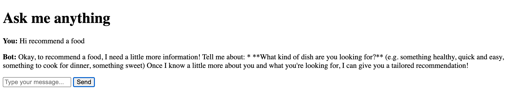 |
| 16 | **Switch:** Wanted to add a button to switch between a few selected free models. Switched between ChatGPT and VS Code to complete this task.  Since we wanted to test a few LLMs at the same time, we decided to try adding a button that allows us to switch between a few models. This took a little longer than the previous debugging, as it required using ChatGPT instead of simple Googling to complete. However, this was all still within an acceptable level of difficulty for setting up a new feature.  Time: 20 mins  Moderate | 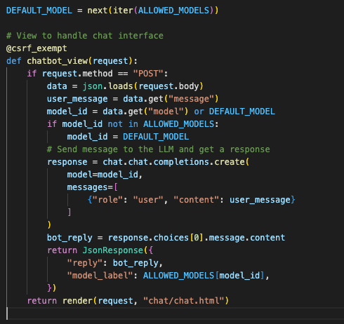 |
| 17 | **Switch:** Switched to Openrouter docs and looked for some free models to test with the chat.  The Openrouter docs make it very easy to look for free models using the filtering tools given. However, we will likely need to read more externally before selecting a final model.  Time: 10 mins  Great | 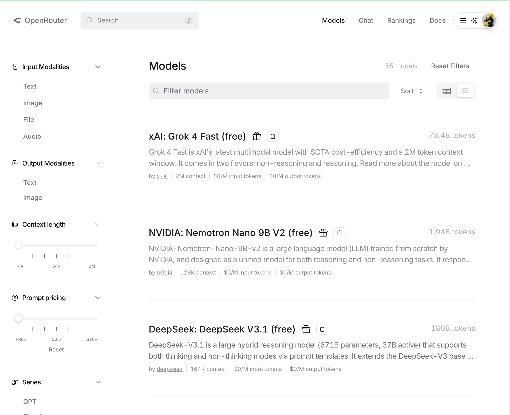 |
| 18 | **Switch:** Implemented the models found in the new interface and tested the result.  After selecting 3 temporary models, we put their codes into our new interface and were able to compare the results of responses side by side.  Time: 10 mins   Great | 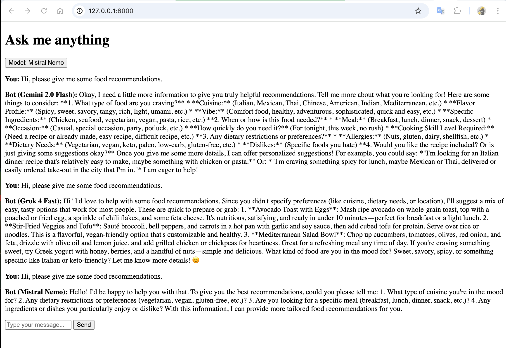 |

