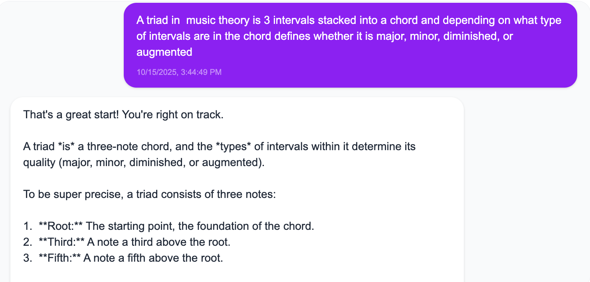
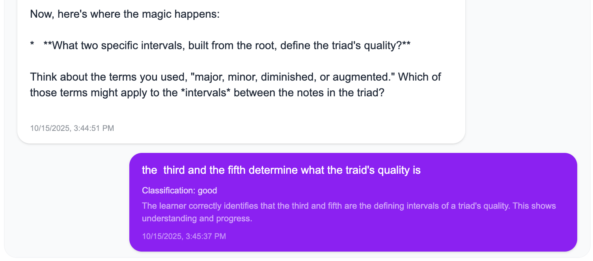
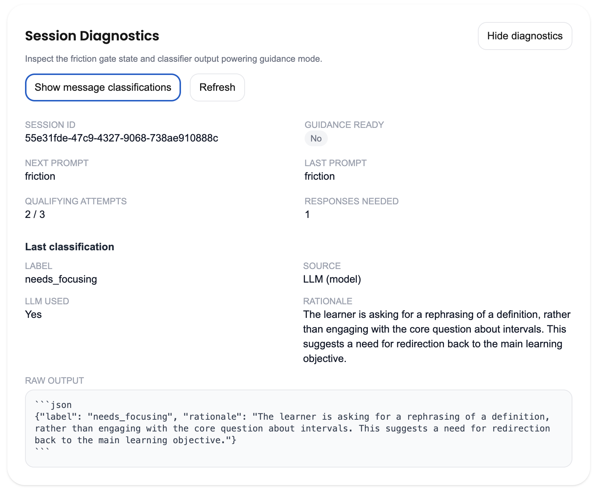
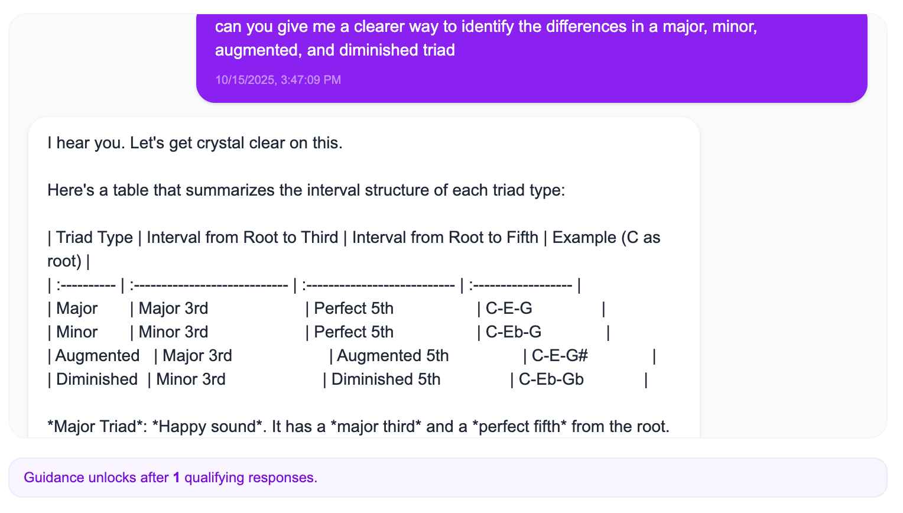
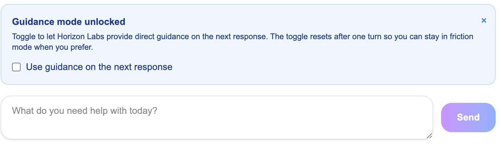
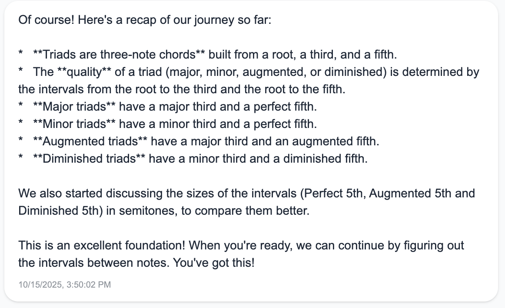

# Student User Research Session – Core Student User Journey 1

## Session Overview
- **Researcher:** Samuel Ruo
- **Date:** 2025-10-15
- **Participant initials / profile:** E.R (Undergraduate, Violin - Music Performance, First Year)
- **CUJ title:** Exploring Music Theory Concepts with LearnLLM Adaptive Chat (Student CUJ 1)
- **Scenario narrative:** E.R is using the LearnLLM platform to understand complex music theory concepts for their coursework. They need to quickly grasp these concepts to apply them in assessments.
- **Application build / version:** A6 - Demo 2
- **Test environment & devices:** Windows 11 PC, Chrome Browser, Using [hosted version](https://horizon-labs-code.vercel.app/) of LearnLLM

## Goals & Hypotheses
- **Primary objectives:** 
  - Assess how intuitively the user can navigate and understand the chat interface.
  - Evaluate how the application's guidance/friction modes affect the user's learning experience.
  - Observe E.R's interaction with the AI responses and their ability to extract useful information.
- **Success criteria / metrics:**
  - Estimated time taken to start a new chat session and understand the features (with limited guidance).
  - Completion of the learning task (explaining a music theory concept) using the AI tutor.
  - Quality of information extracted from AI responses (measured by E.R's ability to summarize key points).
- **Key hypotheses:**
  - H1: E.R will find the chat interface intuitive and easy to navigate without extensive guidance.
  - H2: The friction mode will help E.R focus on learning objectives, while the guidance mode will provide necessary support without overwhelming them.
  - H3: E.R will be able to extract relevant and accurate information from the AI responses to understand music theory concepts.
- **Open questions / risks:**
    - Will E.R feel comfortable using an AI tutor for learning complex subjects?
    - How will E.R respond to the different modes (guidance vs. friction) in terms of engagement and satisfaction?
    - Are there any specific features or improvements that could enhance E.R's learning experience?

## Participant Background
- **Relevant context (experience, motivation, constraints)**
    - E.R is a first-year undergraduate student majoring in Music Performance with a focus on violin.
    - They are familiar with using digital tools for learning but have just started including AI-based platforms in their workflow.
    - E.R is motivated to improve their understanding of music theory efficiently, to excel in their coursework and assessments.
- **Prior experience with similar products / tasks:**
  - Some experience using ChatGPT for general queries, study assistance, and note summarization.
- **Prior familiarity with our product / domain:**
  - None; this is E.R's first interaction with LearnLLM.

## Task Script & Observations
1. **Pre-Task Briefing**
   - Researcher explains the purpose of the session, ensuring E.R understands they are testing the product, not their own abilities.
   - E.R is informed they can think aloud and express any thoughts or frustrations during the session.
2. **Task Introduction**
   - Researcher introduces the specific task E.R will be working on during the session.
   - E.R is encouraged to ask questions if they need clarification on the task.
3. **Task Execution**
    - E.R is given the scenario: "You need to understand a complex music theory concept for your coursework. Use the LearnLLM platform to explore and learn about this concept."
    - E.R begins by navigating to the chat interface and starting a new session.
    - Researcher observes E.R's interactions, noting any hesitations, questions, or comments made during the task.
    - E.R interacts with the AI tutor, asking questions and following up on responses to extract useful information.
    - Researcher takes detailed notes on E.R's behavior, including:
      - General time taken to complete each step.
      - Any points of confusion or frustration.
      - Positive reactions or moments of clarity.
      - Suggestions or feature requests made by E.R.
4. **Post-Task Debriefing**
   - Researcher conducts a debriefing session with E.R to gather feedback on their experience.
   - E.R is asked about their thoughts on the chat interface, the AI tutor's responses, and the overall learning experience.

### Task Step:
**1) Task 1: Exploration and Initial Interaction**
- **Prompt given:** Explore the platform and start a new chat session to learn about a complex music theory concept.
- **Expected outcome:** E.R successfully navigates the platform, starts a new chat session, and engages with the AI tutor to learn about the music theory concept.
- **Actual path taken:** E.R navigates to the chat interface, starts a new session, and begins asking questions about the music theory concept.
- **Time on task (if tracked):** 2 mins.
- **Direct quotes / notable reactions:** "Starting a chat was straightforward and similar to other chat apps I've used." and "I like that it suggests topics right away."
- **Usability issues or friction points:** E.R initially struggled to find the right starting point for their questions.
- **Unmet needs or feature requests:**

**2) Task 2: Deepening Understanding (interacting with friction/guidance modes)**
- **Prompt given:** Ask the AI tutor specific questions about the music theory concept to gain a deeper understanding.
- **Expected outcome:** E.R receives guidance from the AI tutor and is able to clarify their understanding of the concept.
- **Actual path taken:** E.R asks a series of questions and answered the follow up questions, answers vary in depth and clarity depending on the mode (friction/guidance) selected.
- **Time on task (if tracked):** Approximately 20 minutes.
- **Direct quotes / notable reactions:** "These explanations are correct" and "I don't really understand what "good" and "needs_focusing" tags mean in this context."
- **Usability issues or friction points:** E.R found the chat useful for learning new concepts, but articulated it might not be the best for mastering concepts. (This could be where quiz mode comes in.) He was also not able to understand the Session Diagnostics section without assistance.
- **Unmet needs or feature requests:** Make the Session Diagnostics section more user-friendly and easier to understand. Maybe separate the tags into their own section with explanations (not just under the chat interface). May need to be paired with quiz mode to really have a full learning experience.

**3) Task 3: Summarization and Review**
- **Prompt given:** Provide a summary of the key points discussed in the chat session.
- **Expected outcome:** E.R receives a concise summary that highlights the main takeaways from the session.
- **Actual path taken:** E.R requests a summary from the AI tutor and receives a well-structured response.
- **Time on task (if tracked):** Approximately 5 minutes.
- **Direct quotes / notable reactions:** "The summary captured the main points well, which is helpful for my revision."
- **Usability issues or friction points:** The summary was provided without issue (friction mode did not affect this), which is good. He was also able to ask for reclarification of answers already given without issue.
- **Unmet needs or feature requests:**

## Wrap-Up Interview
- **Overall satisfaction (verbatim + inferred rating):** "Overall the chat is really polished and does its job, some things could still be clarified" (4/5)
- **Biggest pain point:** Not understanding the Session Diagnostics section.
- **Favorite moment / value highlight:** Balance of guidance and friction modes helping him learn.
- **Suggestions from participant:** "Maybe a tutorial or help section explaining the different modes and features would be useful."
- **Additional questions asked:** 

## Researcher Reflections
- **Key insights:** The user interacted with the chat interface as designed and expected. The friction and guidance modes provided a balanced learning experience, though some features (like Session Diagnostics) need further clarification. The need/want for a quiz mode to reinforce learning was also highlighted and shows we are on the right track.
- **Surprises vs. hypotheses:** The effectiveness of the AI tutor's friction mode was surprisingly smooth with not much prompt tuning. However may need to evaluate if their is a smoother way to incorporate the guidance mode.
- **Impact on roadmap (priority, scope, timing):** Prioritize improvements in the chat interface to clarify the Session Diagnostics section and get started on quiz mode development to pair with chat for a more comprehensive learning experience.
- **Follow-up actions / owners:** 
  - Samuel to draft improvements for Session Diagnostics section (1 week).
  - Development team to begin working on quiz mode feature (2 weeks).
  - Schedule follow-up session to test updated features (2 weeks).

## Artifacts
- **Screenshots:** See attached screenshots below for session details.

### Session Screenshots
Starting new session and initial question:

Answering the follow up question, utilizing friction mode:

User Prompt Feedback:

Session Diagnostics section:

Guidance mode activated:

Guidance mode toggle:

Summary of the session:

Rephrase of previous answer:

