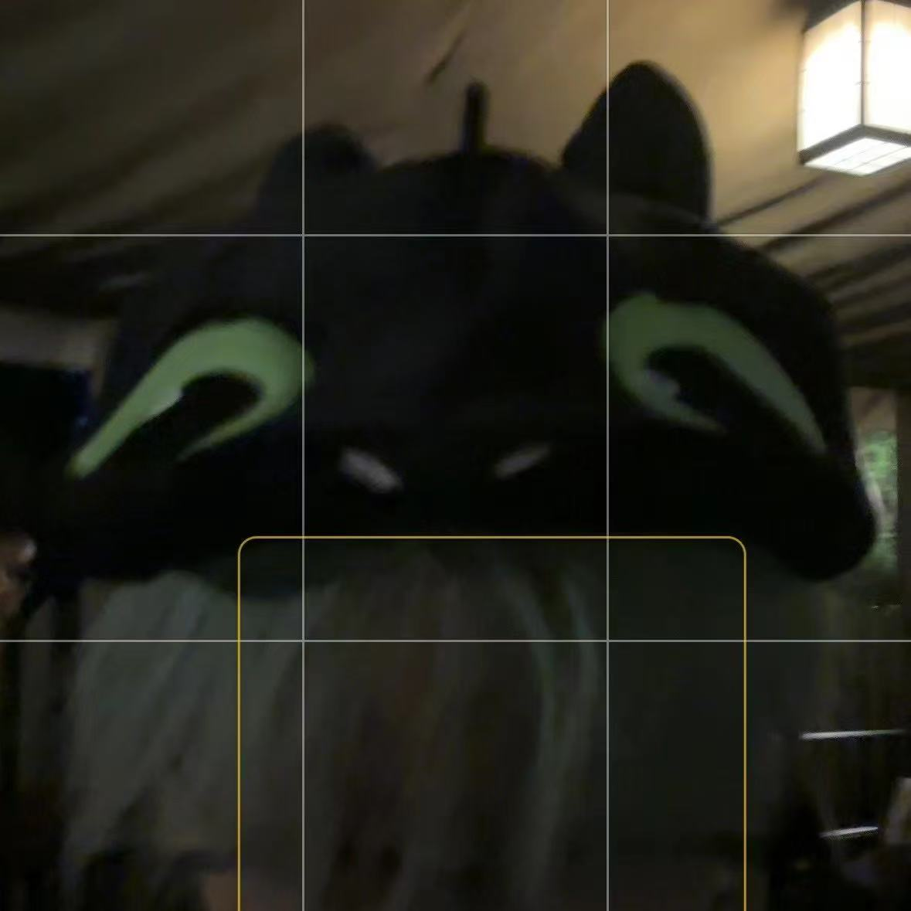

# Kyle LI

- Software Developer
- uoft.li@mail.utoronto.ca

## Links

- [GitHub](https://github.com/KLimerencer)
- [LinkedIn](https://www.linkedin.com/in/kyle-li-575793272/)
- [Resume](https://drive.google.com/file/d/1OzUdS0GGyNYZ1xDzpCG3lpbO4c7hybSH/view?usp=sharing)

## About Kyle

Kyle is from China and currently a fourth-year student at the University of Toronto studying Computer Science. He has rich experiences in software and website development with work contexts. Kyle is currently working under a school Lab with the Cognitive Centivizer Product. When Kyle is not coding, he likes to play video games, tennis, and snooker. 

## Strengths

- High adaptive, willing to learn new things
- Keeping work until meet the expectations
- Being positive all the time

## Weaknesses

- Sometimes understanding informations slow 
- Sometimes having procrastination for non-emergencies
- I am a bit lack of imagination
