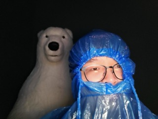

# Samuel Ruo

- Software Developer
- sam.ruo@mail.utoronto.ca

## Links

- [GitHub](https://github.com/SpaceJesusTM)
- [LinkedIn](https://www.linkedin.com/in/samuel-ruo-093a1222b/)
- [Instagram](https://www.instagram.com/samuelruo11/)
- [CV](https://drive.google.com/file/d/1vPuu8pSeWEJTd696qLIcDO3BeNd0l4DA/view?usp=sharing)

## About Sam

Originally from Saskatchewan, Sam is currently a fifth-year student at the University of Toronto studying Computer Science. He has a varied background in software development and research in both academic and industry contexts. Sam's past experiences include working as a research assistant at the Citizen Lab and as a software developer at Environment and Climate Change Canada. When he is not coding, Sam enjoys playing basketball, video games, and listening to music.

## Strengths

- Quick and adaptable learner, able to pick up new skills and technologies
- Team player, willing to help others and take on different roles
- Brings a varied perspective and skill set from diverse experiences

## Weaknesses

- Struggles with multitasking and context switching, preferring to focus on one task at a time
- Can get held up on small details and be hesitant to ask for help, slowing down progress
- While having a varied skill set, can lack depth in certain areas (Jack of all trades, master of none)